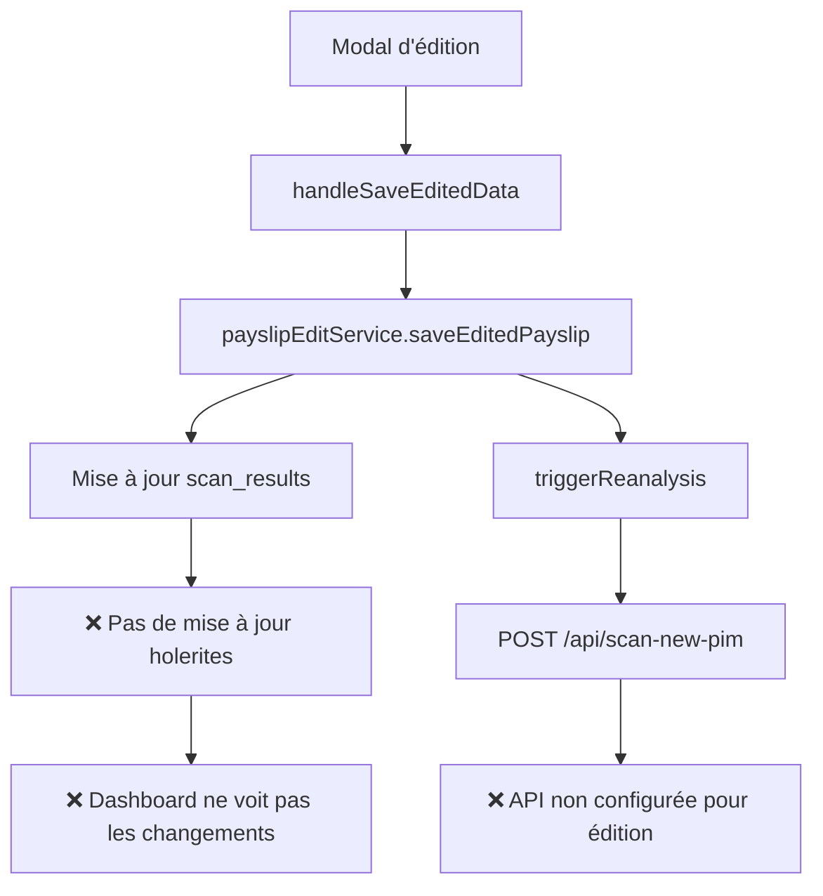

# 🔍 DIAGNOSTIC PROBLÈME SAUVEGARDE APRÈS ÉDITION

## 📋 **PROBLÈME IDENTIFIÉ**

Après modification des données extraites via le modal "Editar Dados Extraídos", la sauvegarde ne fonctionne pas correctement :
- Les champs "Funcionário" et "Empresa" restent à "N/A"
- Les données ne se sauvegardent pas dans Supabase
- L'IA ne réanalyse pas les nouvelles informations

## 🔍 **ANALYSE TECHNIQUE**

### **1. Flux Actuel (Problématique)**



### **2. Problèmes Identifiés**

#### **Problème 1 : Mise à jour incomplète**
- ✅ `payslipEditService` met à jour `scan_results`
- ❌ **PAS de mise à jour de la table `holerites`** (utilisée par le dashboard)

#### **Problème 2 : API non configurée**
- ❌ `/api/scan-new-pim` ne gère que les uploads de fichiers
- ❌ **PAS de support pour les données éditées**

#### **Problème 3 : Réanalyse IA incomplète**
- ❌ La réanalyse IA n'est pas déclenchée correctement
- ❌ Les nouvelles données ne sont pas analysées

## 🛠️ **SOLUTION PROPOSÉE**

### **1. Créer une nouvelle route API**

**Route** : `PUT /api/scan-new-pim/update`
**Fonction** : Mettre à jour les données et déclencher la réanalyse IA

```typescript
// PUT /api/scan-new-pim/update
{
  scanId: string,
  editedData: any,
  userId: string
}
```

### **2. Modifier le service payslipEditService**

**Améliorations** :
- ✅ Mettre à jour `scan_results` ET `holerites`
- ✅ Déclencher la réanalyse IA via la nouvelle API
- ✅ Retourner les données mises à jour

### **3. Logique de réanalyse IA**

**Réanalyse automatique** uniquement si modification de champs clés numériques :
- `salario_bruto`, `salario_liquido`, `descontos`
- Valeurs d'impôts (INSS, IRFF, etc.)
- Autres montants financiers

**Pas de réanalyse** pour champs mineurs :
- `employee_name`, `company_name`, `position`, `period`
- Champs textuels non financiers

### **4. Affichage Dashboard**

**Toujours mettre à jour** dans le dashboard, même pour les champs mineurs :
- Les données corrigées s'affichent immédiatement après sauvegarde
- Rafraîchissement automatique des cartes

## 🎯 **PLAN D'IMPLÉMENTATION**

### **Phase 1 : Nouvelle Route API**
1. Créer `PUT /api/scan-new-pim/update`
2. Logique de mise à jour `scan_results` et `holerites`
3. Logique de réanalyse IA conditionnelle

### **Phase 2 : Amélioration du Service**
1. Modifier `payslipEditService.saveEditedPayslip`
2. Utiliser la nouvelle route API
3. Gestion des erreurs améliorée

### **Phase 3 : Tests et Validation**
1. Test du flux complet
2. Vérification de la mise à jour dashboard
3. Validation de la réanalyse IA

## 📝 **AVANTAGES DE LA SOLUTION**

### **✅ Cohérence des données**
- Mise à jour simultanée de `scan_results` et `holerites`
- Dashboard toujours synchronisé

### **✅ Réanalyse IA intelligente**
- Réanalyse uniquement si nécessaire
- Optimisation des performances

### **✅ Expérience utilisateur**
- Sauvegarde immédiate visible
- Feedback clair sur les modifications

### **✅ Maintenabilité**
- Code modulaire et réutilisable
- Logs détaillés pour le débogage

## 🔧 **TESTS RECOMMANDÉS**

### **Test 1 : Modification de champs mineurs**
1. Modifier `employee_name` et `company_name`
2. Sauvegarder
3. Vérifier l'affichage dashboard (sans réanalyse IA)

### **Test 2 : Modification de champs numériques**
1. Modifier `salario_bruto` ou `descontos`
2. Sauvegarder
3. Vérifier la réanalyse IA et l'affichage dashboard

### **Test 3 : Modification mixte**
1. Modifier champs textuels ET numériques
2. Sauvegarder
3. Vérifier la réanalyse IA partielle

## 📊 **RÉSULTAT ATTENDU**

Après implémentation :
- ✅ Les données éditées sont sauvegardées dans Supabase
- ✅ Le dashboard affiche les nouvelles valeurs
- ✅ La réanalyse IA se déclenche intelligemment
- ✅ L'expérience utilisateur est fluide et cohérente 